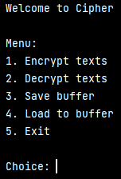

## Table of contents
* [General info](#general-info)
* [Technologies](#technologies)
* [Setup](#setup)
* [More detailed information about modules](#more-detailed-information-about-modules)
* [Application view](#application-view)

### General info
<details>
<summary>Click here to see information about <b>Cipher</b></summary>
Application calls Cipher. It's command application which encrypts and decrypts user's words. It uses Caesar cipher 
ROT13 and ROT47. Encrypted or decrypted words could be saved to or loaded from json file.
</details>

### Technologies
* Design patterns: Facade, AbstractFactory
* JSON serialization and deserialization
* Pytest
### Setup
* Clone the repo ```git clone https://github.com/krzycze4/cipher.git```
* To run application you should execute ```main.py``` module

### Application view


### Sources
This app is inspired by Devs-Mentoring.pl